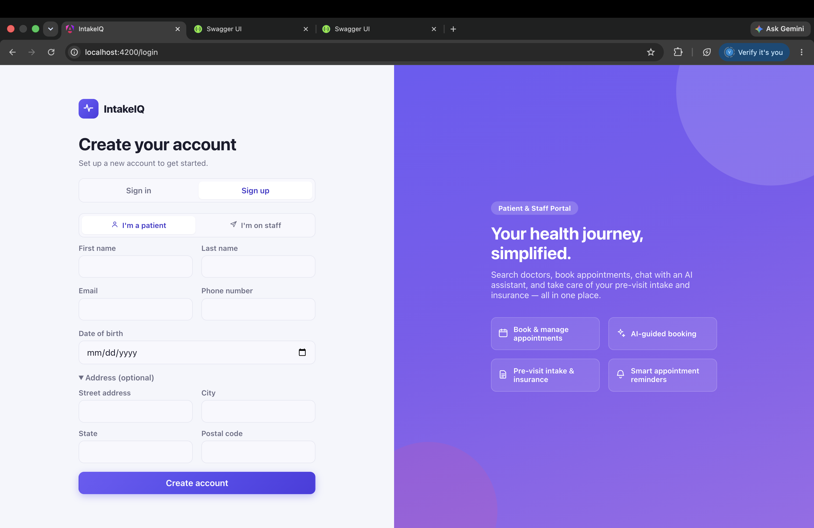
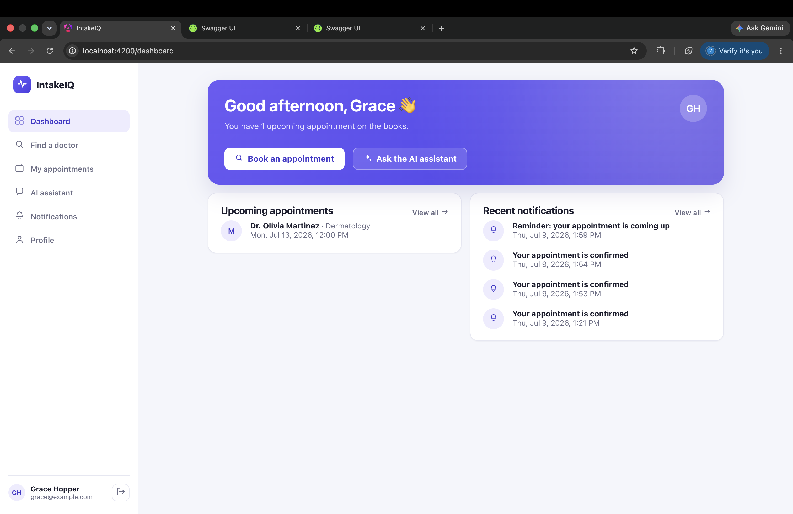
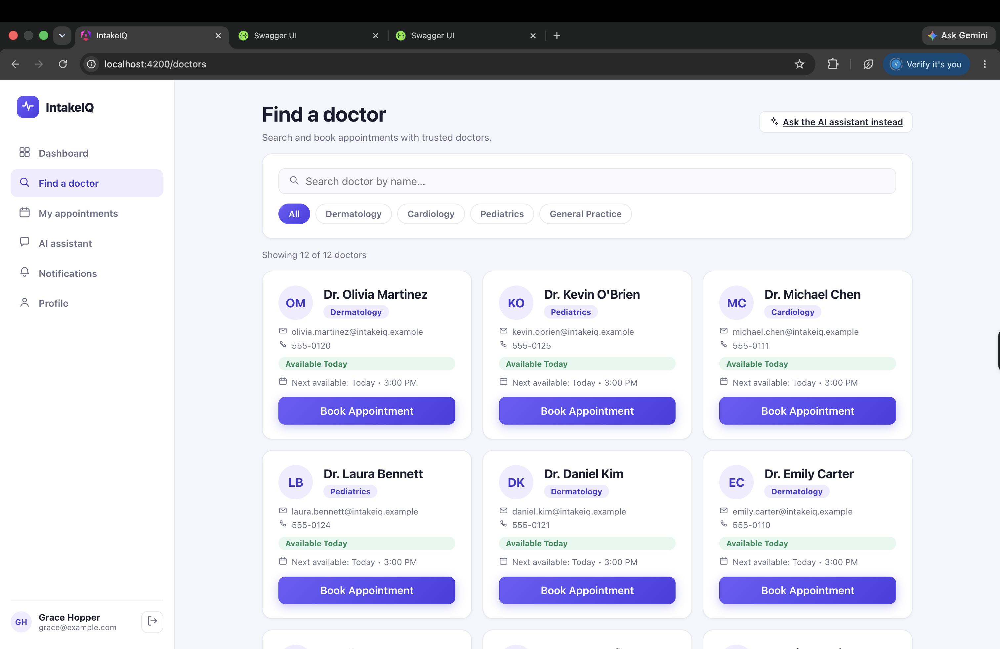
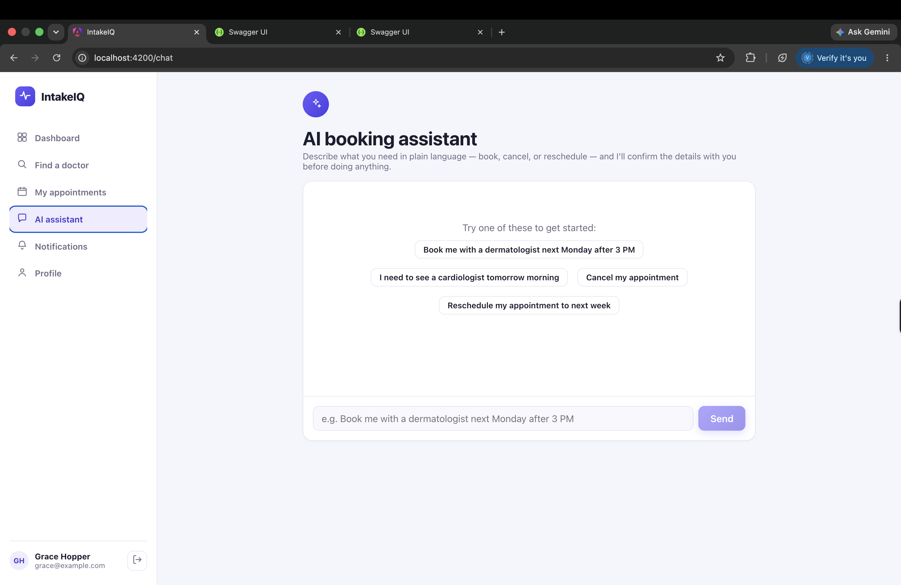

# 🏥 IntakeIQ

**An AI-Powered Patient Intake & Healthcare Appointment Platform** built with .NET, Microservices, Event-Driven Architecture, and a cloud-ready infrastructure strategy.

---

## 📖 Project Overview

IntakeIQ is a cloud-ready healthcare appointment booking platform designed to demonstrate modern backend engineering practices using the .NET ecosystem.

The system allows patients to discover doctors, schedule appointments, receive automated reminders, and interact with an AI assistant to book, cancel, or reschedule appointments in natural language.

Rather than a traditional monolith, IntakeIQ is built as a set of **microservices**, each owning its own data and communicating through REST APIs, domain events, and asynchronous messaging. The platform runs entirely locally today — Docker Compose, RabbitMQ, SQL Server — but its abstractions (the messaging bus, the database connections) are deliberately cloud-portable, so a future migration would be a configuration change rather than a rewrite.

This repository is intended as a portfolio project showcasing production-oriented software architecture, distributed systems principles, cloud-ready design, and practical AI integration.

---

## 🎥 Demo



<br />



<br />



<br />



---

## 🏗 System Architecture

```
                            +------------------+
                            | Angular Frontend |
                            +------------------+
                                      | HTTPS
                                      v
                +-------------------------------------------+
                |                API Gateway                |
                |    JWT validation (Gateway-issued HMAC)   |
                |         Routing · Rate limiting           |
                |     TraceId · Staff-role enforcement      |
                |  (Microsoft Entra External ID: not wired  |
                |   up — see note below)                    |
                +-------------------------------------------+
                    |               |               |               |
                    v               v               v               v
          +----------------+ +----------------+ +----------------+ +----------------+
          | Patient        | | Scheduling     | | Notification   | | AI Assistance  |
          | Service        | | Service        | | Service        | | Service        |
          | (PatientsDB)   | | (SchedulingDB) | | (NotificationDB)| | (AIServiceDB)  |
          +----------------+ +----------------+ +----------------+ +----------------+
                    |               |    ^                ^                |
                    | Domain Events |    |  Domain Events  |                |
                    +-------------->+    +--------+--------+                |
                                     \            |                         |
                                      v            \                       |
                            +---------------------------+                  |
                            |         Event Bus         |                  |
                            |     RabbitMQ (local)      |                  |
                            | Azure Service Bus (cloud) |                  |
                            +---------------------------+                  |
                                                                            |
          Scheduling Service <===== synchronous HTTP (availability/booking) =====+
```

Patient and Scheduling publish domain events; Notification is the only current subscriber. AI Assistance doesn't touch the event bus at all — it calls Scheduling directly over HTTP (the platform's one synchronous service-to-service call) to search availability and place bookings on the patient's behalf.

---

## 🛠 Tech Stack

| Layer             | Technology                                                            |
| ----------------- | --------------------------------------------------------------------- |
| Frontend          | Angular 21                                                            |
| API Gateway       | .NET 10 — custom middleware, JWT validation, correlation ID injection |
| Microservices     | .NET 10 Web API                                                       |
| Architecture      | Microservices · Clean Architecture + DDD                              |
| ORM               | Entity Framework Core                                                 |
| Event Bus (local) | RabbitMQ                                                              |
| Event Bus (cloud) | Azure Service Bus                                                     |
| Databases         | SQL Server (local) · Azure SQL Database (cloud)                       |
| Auth              | Gateway-issued signed JWT (HMAC-SHA256) locally                       |
| Secrets           | `.env` / user-secrets (local)                                         |
| Background Jobs   | Hangfire                                                              |
| Observability     | OpenTelemetry · Serilog                                               |
| Resilience        | Polly (.NET)                                                          |
| AI                | Claude API (Anthropic)                                                |
| Containerisation  | Docker · Docker Compose                                               |
| CI/CD             | GitHub Actions (implemented)                                          |
| Testing           | xUnit                                                                 |

---

## ✨ Key Features

### Authentication & Authorization

The API Gateway issues and validates real, signed JWTs — no external identity provider is required. `POST /api/auth/{patient,staff}/{register,sign-in}` proxies registration/sign-in to Patient's/Notification's existing endpoints and mints an HMAC-SHA256-signed token only on success; every other route requires that token, validated via a standard `AddJwtBearer` (signature, issuer, audience, and expiry all checked — not a decode-only stub). Role-Based Authorization is enforced server-side: Staff-only routes return a real `403` for a non-Staff token, matching the frontend's own role-gated routes.

**Optional cloud swap-in:** Microsoft Entra External ID (OAuth2 / OIDC, RS256, JWKS auto-discovery) is already wired as an alternate branch in the Gateway's JWT config — set `EntraExternalId:Authority`/`Audience` and the Gateway validates against Entra instead of its own signing key, no code changes needed. Not connected in this environment (see the identity note above).

**User Roles**

- Patient
- Staff

IntakeIQ is scoped to these two roles only — there's no Doctor-facing portal or Administrator role planned.

### Patient Management

- Patient Registration
- Profile Management
- Appointment History

### Scheduling & Doctor Discovery

- Search Doctors by specialty and availability
- Book Appointment
- Cancel Appointment
- Reschedule Appointment
- Appointment History

### Pre-Visit Intake & Insurance

- Patient completes a pre-visit intake form (reason for visit) ahead of an appointment
- Patient records insurance details (provider + policy number), with stub eligibility verification
- Staff-facing **Next-Day Intake Worklist**: a daily view of tomorrow's appointments flagged by what's still outstanding (intake and/or insurance), so reminder outreach only needs to happen for patients who actually have something left to do

### Notification Service

- Email Confirmation
- Cancellation & Reschedule Notifications
- Daily reminder sweep — next-day appointments with outstanding intake or insurance get an intake-aware reminder (email body generated by the Claude API); appointments with nothing outstanding are skipped entirely
- Retry failed notifications — a business-level retry loop for failed sends, distinct from Hangfire's own infrastructure-fault retry

### AI Assistance

- Natural Language Appointment Booking — extracts specialty and time window from a plain-language request, and presents multiple doctors/slots as options to choose from when more than one matches, rather than silently picking one
- Natural Language Cancel & Reschedule — the same chat interface handles cancelling or moving an existing appointment, confirming which appointment and (for reschedule) which new time before acting

Examples:

> "Book me with a dermatologist next Monday after 3 PM."
>
> "Cancel my appointment."
>
> "Reschedule my appointment to next week."

### Background Processing

Powered by Hangfire:

- Daily reminder sweep (intake/insurance-aware, see Notification Service above)
- Retry failed notifications

### Event-Driven Communication

Domain events are published to RabbitMQ (local) including:

- `AppointmentCreated`
- `AppointmentCancelled`
- `AppointmentRescheduled`
- `AppointmentIntakeCompleted`
- `PatientInsuranceUpdated`
- `NotificationSent`

---

## 💡 Why This Architecture?

**Microservices**
Each service owns its own business logic and database, enabling independent deployment, scalability, and maintainability.

**Database per Service**
Services do not directly access each other's databases, reducing coupling and preserving service boundaries.

**Dual Event Bus (RabbitMQ + Azure Service Bus)**
Local development uses RabbitMQ for a fast, dependency-free feedback loop. Production deployments swap in Azure Service Bus for managed scaling, dead-lettering, and geo-redundancy — the application code targets a shared messaging abstraction, so the switch is configuration-driven, not code-driven.

**No separate Identity service**
Rather than building and securing a custom Identity microservice, the API Gateway issues and validates its own signed JWTs (see Authentication & Authorization above). The Gateway's JWT config also supports Microsoft Entra External ID as an alternate, config-driven branch — which would offload credential storage, MFA, and social login to a managed identity provider — but that branch isn't connected in this environment.

**Custom API Gateway Middleware**
The gateway is implemented as custom .NET 10 middleware rather than an off-the-shelf reverse proxy, giving full control over JWT validation, correlation ID propagation, and rate limiting — all tuned specifically to this platform's needs.

**Hangfire**
Hangfire handles background processing and scheduled tasks such as reminders and retries. It complements the event bus rather than replacing it — events drive _reactions_, Hangfire drives _time-based_ execution.

**Polly**
Resilience policies (retry, circuit breaker, timeout) are applied at service-to-service and service-to-Azure-resource boundaries, so transient failures in Azure Service Bus, Azure SQL, or downstream services don't cascade.

**API Gateway**
Provides a single entry point for clients and centralizes routing, authentication, rate limiting, and tracing.

**AI Assistant**
AI is integrated as its own service to keep machine learning capabilities isolated from core business logic and independently scalable/replaceable.

---

## 📂 Project Structure

```
IntakeIQ/
├── src/
│   ├── ApiGateway/                  # .NET 10 — routing, JWT issuing/validation, rate limiting
│   │   └── Auth/                    # JwtIssuer, JwtOptions, AuthEndpoints (register/sign-in)
│   ├── Services/
│   │   ├── Patient/
│   │   │   ├── Patient.Api/
│   │   │   ├── Patient.Application/
│   │   │   ├── Patient.Domain/
│   │   │   └── Patient.Infrastructure/
│   │   ├── Scheduling/
│   │   │   ├── Scheduling.Api/
│   │   │   ├── Scheduling.Application/
│   │   │   ├── Scheduling.Domain/
│   │   │   └── Scheduling.Infrastructure/
│   │   ├── Notification/            # same 4-layer shape as Patient/Scheduling, plus Hangfire
│   │   │   ├── Notification.Api/
│   │   │   ├── Notification.Application/
│   │   │   ├── Notification.Domain/
│   │   │   └── Notification.Infrastructure/
│   │   └── AIAssistance/            # same 4-layer shape, plus the Claude API integration
│   │       ├── AIAssistance.Api/
│   │       ├── AIAssistance.Application/
│   │       ├── AIAssistance.Domain/
│   │       └── AIAssistance.Infrastructure/
│   └── Shared/
│       ├── Shared.Contracts/        # Domain event definitions
│       ├── Shared.Messaging/        # RabbitMQ / Azure Service Bus abstraction
│       └── Shared.Observability/    # Serilog, OpenTelemetry, correlation ID, Polly resilience
├── frontend/                        # Angular 21 app — standalone/zoneless, Signals, no NgRx
│   ├── src/app/
│   │   ├── core/                    # auth (stub/Entra seam), API clients, shared models, date utils
│   │   ├── features/
│   │   │   ├── auth/                # login / sign-up
│   │   │   ├── dashboard/
│   │   │   ├── doctors/             # search + booking
│   │   │   ├── appointments/        # list, cancel, reschedule
│   │   │   ├── chat/                # AI assistant
│   │   │   ├── profile/
│   │   │   ├── notifications/
│   │   │   └── staff/               # Staff-only reminder worklist
│   │   ├── shared/                  # icon component, availability calendar
│   │   └── shell/                   # app shell (sidebar nav)
│   ├── Dockerfile                   # two-stage: node build -> nginx serve
│   └── nginx.conf
├── tests/
│   ├── Patient.Tests/
│   ├── Scheduling.Tests/
│   ├── Notification.Tests/
│   ├── AIAssistance.Tests/
│   ├── ApiGateway.Tests/
│   └── Shared.Messaging.Tests/      # real RabbitMQ integration test, needs a live broker
├── docker-compose.yml
├── IntakeIQ.sln
└── .github/workflows/               # CI/CD pipelines
```

---

## 🚀 Getting Started

### Prerequisites

- .NET 10 SDK
- Node.js + Angular CLI (for the frontend)
- Docker Desktop
- SQL Server (local) or Azure SQL Database (cloud)
- RabbitMQ (local) or Azure Service Bus (cloud)
- Redis

### Run Locally (Docker Compose)

```bash
docker compose up --build
```

Once the containers are running:

- API Gateway: `http://localhost:5080` (not 5000 — macOS's AirPlay Receiver squats on 5000 by default on every Mac, so the Gateway's host port is mapped to 5080 in `docker-compose.yml` to avoid that collision)
- Swagger: `/swagger`
- Hangfire Dashboard: `/hangfire`
- Angular Frontend: `http://localhost:4200`

### Cloud Deployment (Azure)

The platform is designed to deploy to:

- **Azure App Service** — hosts the API Gateway and each microservice
- **Azure API Management** — external-facing API management layer in front of the gateway
- **Azure Service Bus** — replaces RabbitMQ for domain event delivery
- **Azure SQL Database** — replaces local SQL Server per service
- **Azure Key Vault** — connection strings, JWT signing keys, and third-party API keys
- **Azure Application Insights** — distributed tracing and telemetry
- **Azure Container Registry** — container image storage for CI/CD

None of this has been provisioned or deployed — it's the architecture's intended cloud target, not a live environment.

---

## 📚 API Documentation

Every microservice exposes OpenAPI (Swagger) documentation. Typical endpoints include:

- `/api/patients` (including nested reads: `/appointments`, `/notifications`, and `/insurance`)
- `/api/doctors`
- `/api/appointments` (including `/intake`)
- `/api/notifications` (including `/staff/accounts`)
- `/api/assistant`

---

## ⚠ Disclaimer

This project is developed for portfolio purposes only.

The AI assistant provides informational guidance and appointment assistance. It does not provide medical diagnoses, treatment recommendations, or professional medical advice. Always consult a qualified healthcare professional for medical concerns.

---

## Author

Vidhi Sheth

## 

This is a private repository. If you'd like a live demo or code walkthrough, feel free to reach out.

